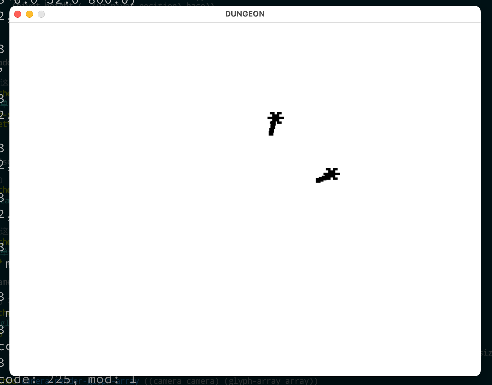

# 文档

这是一个使用 lisp 编写的模仿 door-in-the-woods 游戏渲染风格的demo游戏，目前还在开发中。

该项目开发目标是作为一个较为简单的2D渲染引擎，使用socket与外界进行通信，主要目的是为老派roguelike游戏提供一个极具风格的前端渲染服务。

## 待完成

- [x] 彩色glyph渲染
- [ ] 抽象游戏地图
- [ ] HUD
- [ ] 输入处理
- [ ] 完备的渲染接口设计
- [ ] 添加socket通信接口
- [ ] 简单的roguelike测试
- [ ] 接入nethack

## 进度

init_version

## 渲染算法
TODO
